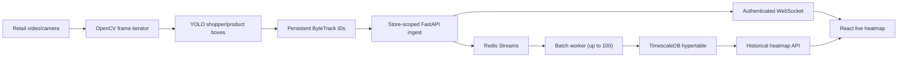

# Consumer Attention Mapping System

This repository is a Milestone 2 implementation of a multi-tenant retail attention pipeline. It combines a FastAPI/SQLAlchemy backend, Redis Streams, TimescaleDB, YOLO/ByteTrack utilities, gaze/dwell geometry, and a React heatmap dashboard.

The project is demonstrable, but it is not a production-validated retail model. Seeded shopper paths and attention events are fixtures for exercising APIs and UI components; they are not outputs from trained AI.

## Current evidence level

| Area | Current status |
| --- | --- |
| API, auth, tenant/store scoping | Implemented for the documented workflows |
| Three-zone/four-camera flagship layout | Seeded/reconciled for demonstration |
| Lazy video preprocessing and bounded batches | Implemented |
| YOLO dataset validation and run manifests | Implemented |
| YOLO plus persistent ByteTrack adapter | Implemented; controlled 12-frame E2E smoke passed, representative retail-video quality not benchmarked |
| Gaze-ray/shelf intersection and dwell state machine | Implemented; requires a real head-pose model and calibration |
| Redis Streams, batch persistence, TimescaleDB, WebSockets | Implemented; production load test not yet reported |
| Live and historical heatmap | Implemented as an application workflow |
| One-epoch transfer-learning smoke | Completed on COCO8 with a pretrained YOLOv8n checkpoint; integration evidence only, not a retail benchmark |
| COCO/SKU-110K/Retail Product Checkout fine-tuning | Not completed with real retail data |
| Cross-camera re-identification | Not implemented |

No detector mAP, tracker IDF1/HOTA/MOTA, FPS, queue throughput, or end-to-end latency is claimed without a saved evaluation record.

## Architecture



Redis is the durable ingest queue in the Compose deployment. The API can use an in-memory queue for local development, but that fallback is explicitly non-durable and does not satisfy the milestone's crash-proof ingestion outcome.

## Quick start with Docker Compose

Requirements: Docker Desktop with Docker Compose v2 and ports 3000, 8000, 5432, and 6379 available.

From the repository root in PowerShell:

```powershell
Copy-Item .env.example .env
# Edit .env and replace POSTGRES_PASSWORD and SECRET_KEY before sharing the deployment.
docker compose up --build
```

The default backend image runs the API, Redis worker, and time-series pipeline without the large PyTorch/Ultralytics stack. Set `INSTALL_ML=true` in `.env` before the first build when the container itself must execute the training API or YOLO inference. This selects CPU-only PyTorch and increases build size and time.

Open:

- Dashboard: `http://localhost:3000`
- API documentation: `http://localhost:8000/docs`
- API health: `http://localhost:8000/`

Inspect service health and the application pipeline:

```powershell
docker compose ps
docker compose logs --follow backend
```

The `timescale-bootstrap` service is expected to run once and exit successfully after it converts `tracking_observations` into a hypertable. Persistent database and Redis data live in named Docker volumes.

Stop the application without deleting data:

```powershell
docker compose down
```

`docker compose down --volumes` also deletes the local database and Redis volumes; use it only when an intentional reset is required.

## Demo login

The startup seed creates these local-only accounts:

| Role | Email | Password |
| --- | --- | --- |
| Administrator | `admin@attention.ai` | `Admin@123` |
| Store Manager | `manager@attention.ai` | `Manager@123` |
| Retail Analyst | `analyst@attention.ai` | `Analyst@123` |
| Marketing Manager | `marketing@attention.ai` | `Marketing@123` |

Replace the seed credentials and token secret before any non-local deployment.

## Local development

Start only the stateful services:

```powershell
Copy-Item .env.example .env
docker compose up --detach timescaledb redis
```

Set up the backend with a current Python 3 release supported by the pinned dependencies (the milestone was exercised with Python 3.13):

```powershell
cd backend
python -m venv .venv
.\.venv\Scripts\Activate.ps1
python -m pip install --upgrade pip
python -m pip install --requirement requirements.txt
Copy-Item ..\.env.example .env
uvicorn app.main:app --reload --host 0.0.0.0 --port 8000
```

The copied backend `.env` uses `localhost` for TimescaleDB and Redis. If PostgreSQL is unavailable, the API can fall back to SQLite for development. If Redis is unavailable and `ALLOW_MEMORY_STREAM_FALLBACK=true`, it can fall back to the non-durable memory queue. Check the actual active modes through `GET /api/pipeline/status` rather than assuming the production services are in use.

In a second terminal:

```powershell
cd frontend
npm ci
npm run dev
```

The Vite development server is available at `http://localhost:5173` and currently calls the API at `http://localhost:8000/api`.

## Dataset preparation

Real datasets are not included. Obtain the assigned data from its official source and comply with its license:

- COCO for pretrained shopper/person knowledge.
- SKU-110K and Retail Product Checkout for shelf/product fine-tuning.
- Retail Store Traffic videos for preprocessing, MOT, and analytics validation.

The validator expects the normal YOLO detection layout:

```text
dataset-root/
  dataset.yaml
  images/
    train/
    val/
  labels/
    train/
    val/
```

Validate image/label pairing, normalized boxes, class IDs, and readable images before training:

```powershell
cd backend
python scripts/validate_yolo_dataset.py C:\datasets\attention-retail\dataset.yaml `
  --verify-images `
  --manifest artifacts\manifests\attention-retail.json
```

The manifest records image/annotation counts and a content digest. Review every error and warning; do not bypass validation for a local retail dataset.

## Synthetic smoke training

This is the bounded plumbing check used to prove that Ultralytics can load, train for one epoch, validate, and write artifacts:

The base API requirements intentionally keep the large ML runtime optional. Create a separate environment for training, install the CPU or CUDA build of PyTorch appropriate to the machine, and then install the pinned Ultralytics version used for this milestone. A CPU-only environment can be prepared with:

```powershell
cd backend
python -m venv .venv-ml
.\.venv-ml\Scripts\Activate.ps1
python -m pip install --upgrade pip
python -m pip install torch torchvision --index-url https://download.pytorch.org/whl/cpu
python -m pip install --requirement requirements-ml.txt
```

For NVIDIA training, use the matching CUDA-enabled PyTorch wheels instead of the CPU index and verify `torch.cuda.is_available()` before selecting `--device 0`.

```powershell
cd backend
python scripts/train_yolo.py --smoke --model yolov8n.pt --device cpu `
  --project ml_runs --name synthetic-smoke
```

With no `--data` argument, the command generates a tiny synthetic one-class dataset. Smoke mode forces one epoch, 160-pixel images, a batch no larger than two, zero workers, and no cache. Each invocation creates a unique directory containing:

- `run.json` with requested/effective configuration, package versions, status, observed metrics, errors, and artifact hashes.
- `dataset_manifest.json` with the synthetic dataset digest.
- Ultralytics outputs such as `results.csv`, plots, and `weights/best.pt`/`weights/last.pt` when training succeeds.

Even if the smoke validation values look high, they describe a few generated rectangles and must not be reported as retail accuracy.

### Recorded training attempts

The following command was actually run on July 14, 2026 with the repository's existing Python 3.13 virtual environment:

```powershell
.\venv\Scripts\python.exe scripts\train_yolo.py --smoke --device cpu `
  --project .\ml_runs --name smoke-plumbing
```

Observed result:

- The generated dataset passed validation: 3 images, 3 annotations, 0 validation errors, and 0 warnings.
- The effective bounded configuration was one epoch, 160-pixel images, batch size 2, and zero workers.
- Training stopped before model loading because `ultralytics` and `torch` were absent from that environment.
- The run has `status: failed`, `metrics: {}`, and no model artifacts. It is not a completed training run.
- The truthful failure record is [`backend/ml_runs/smoke-plumbing-20260714T050233Z-96b782db/run.json`](backend/ml_runs/smoke-plumbing-20260714T050233Z-96b782db/run.json).

After the optional ML environment was installed, a pretrained one-epoch COCO8 transfer-learning smoke run completed from the repository root with this exact command:

```powershell
& backend\.venv-ml\Scripts\python.exe backend\scripts\train_yolo.py `
  --smoke `
  --data coco8.yaml `
  --skip-dataset-validation `
  --model yolov8n.pt `
  --device cpu `
  --project backend\ml_runs `
  --name coco8-transfer-smoke
```

The durable run record is [`backend/ml_runs/coco8-transfer-smoke-20260714T050925Z-4828236b/run.json`](backend/ml_runs/coco8-transfer-smoke-20260714T050925Z-4828236b/run.json). It records Ultralytics 8.4.95, PyTorch 2.13.0+cpu, seed 42, one epoch, 160-pixel images, batch size 2, four COCO8 training images, four COCO8 validation images, and 16 hashed artifacts including `weights/best.pt` and `weights/last.pt`.

Observed aggregate validation values saved in `run.json` were:

| Metric | Observed value |
| --- | ---: |
| Precision (boxes) | 0.938866 |
| Recall (boxes) | 0.266667 |
| mAP50 (boxes) | 0.459060 |
| mAP50-95 (boxes) | 0.325967 |

These values are reported only to prove metric capture. COCO8 is an eight-image integration dataset, the validation split has only four images, the run trained for one epoch at reduced resolution, and the data is not SKU-110K, Retail Product Checkout, or Retail Store Traffic. The values are therefore non-retail, non-benchmark smoke results and cannot support a Milestone 2 accuracy claim.

The authenticated training-job API/UI path was also exercised with `smoke: true`. Training run `ee2f826d-08fa-4c86-bf31-44e143feb301` reached `completed`, recorded `current_epoch: 1`, persisted 24 observed metric fields with no error, and retained its artifacts at [`backend/artifacts/models/store-1-detection-20260714T051420Z-a88f6cce`](backend/artifacts/models/store-1-detection-20260714T051420Z-a88f6cce). That job used the three-image generated synthetic dataset; its values are intentionally not presented as model performance. It verifies API queueing, background execution, database status updates, metric persistence, and artifact-path reporting.

## Real retail-data fine-tuning

After dataset review, use a pretrained checkpoint and a real YOLO YAML. The following is a starting command, not a claim that these hyperparameters are optimal:

```powershell
cd backend
python scripts/train_yolo.py `
  --data C:\datasets\attention-retail\dataset.yaml `
  --model yolov8n.pt `
  --epochs 20 `
  --image-size 640 `
  --batch-size 8 `
  --device 0 `
  --freeze 10 `
  --verify-images `
  --project ml_runs `
  --name retail-finetune
```

Choose epoch count, batch size, device, and frozen layers for the available hardware. Preserve the generated `run.json`, dataset manifest, checkpoint hashes, and `results.csv`. Report held-out metrics only from a split that was not used to tune the run. The repository currently has no completed real-retail fine-tuning record.

## Video tracking

Run a saved detector through persistent ByteTrack. Repeat `--class-id` for the class IDs to retain; omit it to keep every detected class.

```powershell
cd backend
python scripts/track_video.py C:\datasets\traffic\camera-1.mp4 `
  --model ml_runs\<run-directory>\weights\best.pt `
  --class-id 0 `
  --max-frames 1000 `
  --output artifacts\tracks\camera-1.jsonl
```

The JSONL output contains frames, boxes, confidence, and tracker IDs. ByteTrack state is continuous within one command/video. It does not establish the same identity across separate camera feeds; true four-camera identity continuity requires a separately designed cross-camera re-identification system.

To stream real tracked observations into the Redis-backed API instead of writing offline JSONL, set the bearer token in an environment variable and use the worker bridge:

```powershell
$env:ATTENTION_API_TOKEN = $login.access_token
python scripts/process_video.py C:\datasets\traffic\camera-1.mp4 `
  --model ml_runs\<run-directory>\weights\best.pt `
  --store-id 1 `
  --camera-id 1 `
  --zone-id 1 `
  --token-env ATTENTION_API_TOKEN `
  --device cpu `
  --classes 0 `
  --max-frames 1000
```

The bridge decodes lazily, retains only real ByteTrack IDs, normalizes coordinates, and posts batches of at most 100 observations. Its final summary distinguishes decoded/processed frames, detections, prepared observations, untracked detections, accepted events, unconfirmed failures, and processing FPS.

### Controlled end-to-end worker smoke

After the COCO8 smoke checkpoint was saved, a temporary 12-frame MP4 was generated by repeating the local COCO8 validation image `000000000036.jpg`. The transient clip was removed after verification. With a local API on port 8011 and the login token stored in `ATTENTION_API_TOKEN`, this exact worker command was run from the repository root:

```powershell
backend\.venv-ml\Scripts\python.exe backend\scripts\process_video.py `
  backend\tmp\e2e\person_track.mp4 `
  --model backend\ml_runs\coco8-transfer-smoke-20260714T050925Z-4828236b\weights\best.pt `
  --store-id 1 `
  --camera-id 1 `
  --zone-id 1 `
  --api-base http://127.0.0.1:8011/api `
  --token-env ATTENTION_API_TOKEN `
  --max-frames 12 `
  --device cpu `
  --confidence 0.1 `
  --classes 0
```

Observed worker summary: 12 decoded/processed frames, 12 detections, 12 prepared observations, 12 accepted, 0 failed, one HTTP batch, 8.594 seconds elapsed, and 1.396 measured FPS. Authenticated checks of `/api/stores/1/stream/status` and `/api/stores/1/heatmap` then reported 12 persisted observations, 12 heatmap samples, one heatmap cell, and a maximum cell value of 10.6206.

This was a controlled integration test using a repeated still image, a tiny COCO8-derived checkpoint, and the API's non-durable memory queue fallback. It verifies the saved-checkpoint -> ByteTrack -> authenticated ingest -> worker persistence -> heatmap path. It is not retail-video accuracy, sustained throughput, Redis durability, TimescaleDB validation, or a production FPS benchmark.

## API and WebSocket checks

Obtain a token and query the active infrastructure:

```powershell
$loginBody = @{ email = 'analyst@attention.ai'; password = 'Analyst@123' } | ConvertTo-Json
$login = Invoke-RestMethod -Method Post -Uri http://localhost:8000/api/auth/login `
  -ContentType 'application/json' -Body $loginBody
$headers = @{ Authorization = "Bearer $($login.access_token)" }
Invoke-RestMethod -Uri http://localhost:8000/api/pipeline/status -Headers $headers
Invoke-RestMethod -Uri http://localhost:8000/api/stores/1/stream/status -Headers $headers
```

Milestone 2 streaming endpoints:

- `POST /api/stores/{store_id}/tracking/ingest`
- `GET /api/stores/{store_id}/tracking/observations`
- `GET /api/stores/{store_id}/heatmap`
- `GET /api/stores/{store_id}/stream/status`
- `GET /api/stores/{store_id}/checkout/status`
- `POST /api/stores/{store_id}/attention/gaze-estimate`
- `GET /api/pipeline/status`
- `POST /api/training/runs`
- `GET /api/training/runs`
- `GET /api/training/runs/{run_id}`
- `WS /ws/stores/{store_id}/tracking?token=<access-token>`

The ingest route validates that all camera and zone IDs belong to the route's store before publishing events.

## Verification commands

```powershell
python -m compileall backend\app backend\scripts

cd backend
.\venv\Scripts\python.exe -m unittest discover -s tests -v
cd ..

cd frontend
npm ci
npm run build
cd ..

docker compose config --quiet
docker compose build
```

Checks completed on July 14, 2026:

- Backend compile check passed.
- All 21 backend unit tests passed.
- Frontend production build passed (Vite reported only its chunk-size advisory).
- `docker compose config --quiet` passed.
- Docker image build could not be exercised because the Docker Desktop Linux daemon was not running; the Compose and Dockerfile definitions are present but still require a daemon-backed build test.
- The completed COCO8 smoke run and its exact metrics/artifacts are recorded above.
- The authenticated training API/UI smoke reached `completed` and retained its run artifacts/status record.
- The 12-frame controlled saved-checkpoint worker/API/heatmap smoke completed with all 12 observations accepted and persisted; its constraints are recorded above.

A successful application build is not a model-quality result. For acceptance, separately record detector metrics, MOT identity metrics, FPS/resource use, Redis-to-Timescale persistence counts, WebSocket latency/reconnect behavior, and heatmap calibration on representative retail footage.

## Known limitations

- The repository does not bundle or license the four assigned datasets.
- Real SKU/product class mapping and combined-dataset sampling still require project-specific decisions.
- No real-retail held-out detector or tracker score is currently established.
- Gaze geometry does not itself estimate head pose; it consumes a gaze/head-pose direction produced elsewhere.
- Product interaction and checkout anomaly thresholds require labeled validation and business rules.
- ByteTrack provides within-stream continuity, not permanent cross-camera identity.
- Seeded coordinates, dwell values, gaze confidence, and attention events are UI/API fixtures, not ground truth or model evaluation.

See [docs/MILESTONE_2_REPORT.md](docs/MILESTONE_2_REPORT.md) for the requirement-by-requirement assessment.
