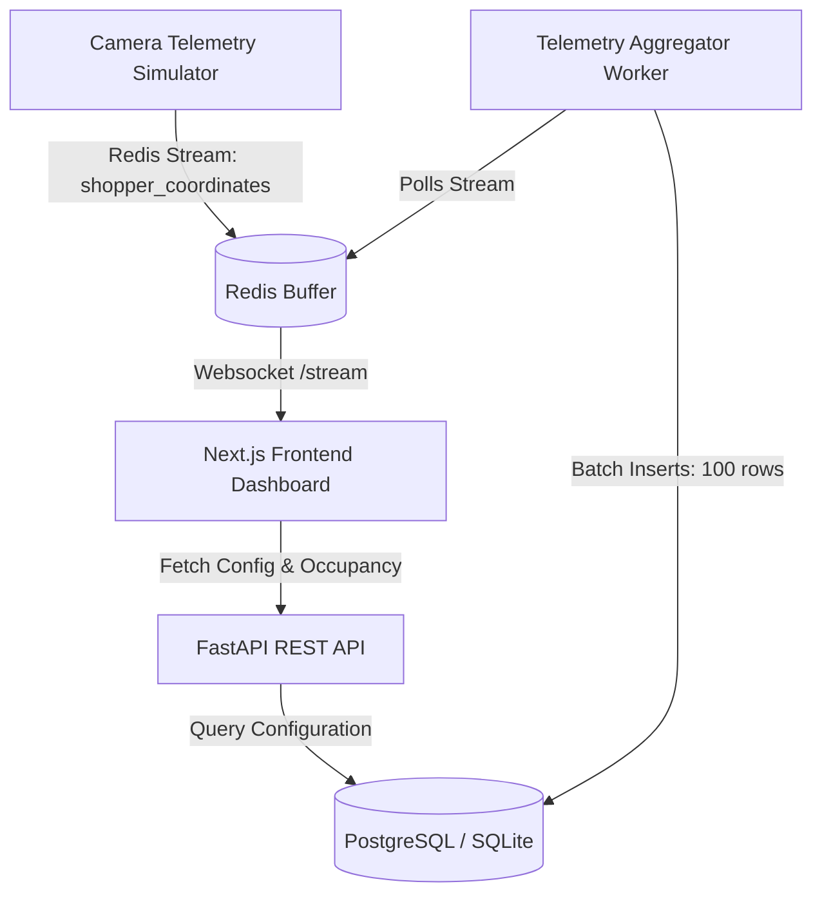

# CAMS: Consumer Attention Mapping System

CAMS is a real-time instore shopper tracking and spatial intelligence platform. It converts live computer vision coordinates from security cameras into coordinate heatmaps, gaze vectors, path trails, and queue length statistics to optimize retail layout configurations.

---

## 🏗️ System Architecture

CAMS uses a decoupled, three-tier architecture designed for high-throughput tracking log ingestion:



1. **Frontend Dashboard (Next.js)**: Displays visual retail heatmaps, vector path coordinates, real-time metrics cards, and lane bottleneck alerts via HTML5 Canvas.
2. **Backend Engine (FastAPI)**: Manages authentication, multi-tenant store layouts, configuration CRUD endpoints, and live state streaming via WebSockets.
3. **Telemetry Ingestion Worker**: A separate thread that reads coordinate paths from Redis, maintains live shopper states, and logs telemetry batches (100 rows per transaction) to PostgreSQL.
4. **Camera Simulator**: Generates realistic shopper velocities, lingering durations, and gaze vectors tailored to store zones.

---

## 🗄️ Database Schemas

The database structure supports multi-tenant configurations and high-resolution tracking history:

* **`users`**: Login credentials and role privileges (`Administrator`, `Store Manager`, `Retail Analyst`, `Marketing Manager`).
* **`stores`**: Multi-tenant store profile mapping.
* **`shelves`**: Physical boundaries of inventory shelves (`Zone A Foyer`, `Shelf 1 Beverages`, `Shelf 2 Snacks`, `Zone C Checkout Lanes`).
* **`products`** & **`shelf_products`**: Product catalogue and mapping coordinates.
* **`cameras`**: Placements and rotations of monitoring devices.
* **`shopper_positions`**: High-performance logging table tracking coordinates (`x`, `y`, `gaze_x`, `gaze_y`, `dwell_time`).

---

## 🚀 Getting Started

### 📋 Prerequisites
* **Node.js**: v18 or later
* **Python**: v3.10 or later
* **PostgreSQL** (Optional, falls back to SQLite automatically if offline)
* **Redis** (Optional, falls back to memory simulator automatically if offline)

### 🐳 1. Docker Deployment (Recommended - Single Command)

To build and launch the entire CAMS stack (PostgreSQL, Redis, FastAPI Backend, Next.js Dashboard) in containerized isolation:

1. Run Docker Compose from the project root:
   ```bash
   docker-compose up --build
   ```
2. Open [http://localhost:3000](http://localhost:3000) in your browser.

---

### 🔧 2. Manual Local Setup (Alternative)

#### Backend Setup
1. Navigate to the backend directory:
   ```bash
   cd backend
   ```
2. Create and activate a virtual environment:
   ```bash
   python -m venv .venv
   # On Windows:
   .venv\Scripts\activate
   # On macOS/Linux:
   source .venv/bin/activate
   ```
3. Install dependencies:
   ```bash
   pip install -r requirements.txt
   ```
4. Seed the database and download datasets:
   ```bash
   python seed.py
   python populate_history.py
   python download_datasets.py
   ```
5. Launch the FastAPI backend:
   ```bash
   uvicorn app.main:app --host 127.0.0.1 --port 8001 --reload
   ```

#### Frontend Setup
1. Navigate to the frontend directory:
   ```bash
   cd ../frontend
   ```
2. Install npm packages:
   ```bash
   npm install
   ```
3. Run the development server:
   ```bash
   npm run dev -- --port 3000
   ```
4. Open [http://127.0.0.1:3000](http://127.0.0.1:3000) in your web browser.

---

## 🔑 Test Accounts
CAMS provides preset test users with role-based access configurations:

* **Administrator**: `admin@attention.com` (Password: `password123`)
* **Store Manager**: `manager@attention.com` (Password: `password123`)
* **Retail Analyst**: `analyst@attention.com` (Password: `password123`)
* **Marketing Manager**: `marketing@attention.com` (Password: `password123`)

---

## 🛠️ Data Utilities

* **`python seed.py`**: Drops old tables, creates database schema, and seeds a flagship store layout.
* **`python populate_history.py`**: Generates multi-day mock logs for coordinate analytics.
* **`python export_db.py`**: Queries all 7 tables in the database and writes clean JSON exports into the `backend/exports/` directory.
