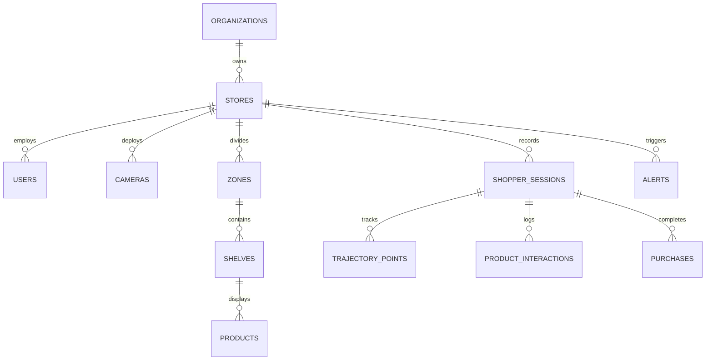

# Database Schema Documentation
**System**: AI-Powered Consumer Attention Intelligence Platform  
**Database**: PostgreSQL 16 (Relational DB) + Redis 7 (Streaming & In-Memory Cache) + TimescaleDB (Time-Series Telemetry)

---

## 1. Entity-Relationship Diagram (Relational Schema)



---

## 2. Table Specifications

### `users`
Stores platform user credentials, role assignments, and active status.
- `id` (VARCHAR, PK): Unique User ID (e.g. `USR-001`).
- `email` (VARCHAR, UNIQUE, INDEX): Login email address.
- `hashed_password` (VARCHAR): Password hash (Bcrypt).
- `full_name` (VARCHAR): Employee full name.
- `role` (VARCHAR): Role designation (`STORE_MANAGER`, `RETAIL_ANALYST`, `MARKETING_MANAGER`, `ADMINISTRATOR`).
- `store_id` (VARCHAR, FK -> `stores.id`): Assigned physical store ID.
- `is_active` (BOOLEAN): Account active state.

---

### `cameras`
RTSP camera hardware registry and spatial homography calibration matrices.
- `id` (VARCHAR, PK): Camera ID (e.g. `CAM-01`).
- `store_id` (VARCHAR, FK -> `stores.id`): Store location ID.
- `name` (VARCHAR): Camera descriptive name.
- `status` (VARCHAR): Stream status (`ONLINE`, `DEGRADED`, `OFFLINE`).
- `ip_address` (VARCHAR): Local IP address of camera stream.
- `resolution` (VARCHAR): Video resolution (e.g. `1920x1080`).
- `homography_matrix` (JSON): 3x3 perspective transformation matrix mapping image pixels to real store coordinate grid.

---

### `shopper_sessions`
Anonymous shopper journeys tracked across camera vision feeds.
- `id` (VARCHAR, PK): Session ID (e.g. `SES-1001`).
- `store_id` (VARCHAR, FK -> `stores.id`): Store ID.
- `shopper_id` (VARCHAR): Anonymous tracking ID.
- `start_time` (TIMESTAMP): Entry timestamp.
- `end_time` (TIMESTAMP): Exit timestamp.
- `total_dwell` (FLOAT): Total dwell duration in seconds.
- `path_distance` (FLOAT): Distance traversed in meters.
- `segment` (VARCHAR): Behavioral classification (`Explorers`, `Quick Buyers`, `Comparison Shoppers`, `Impulse Buyers`, `Brand Loyal Customers`).

---

### `trajectory_points`
Time-series spatial coordinate points recorded during shopper movement.
- `id` (INTEGER, PK, AUTOINCREMENT)
- `session_id` (VARCHAR, FK -> `shopper_sessions.id`)
- `timestamp` (TIMESTAMP): Recording time.
- `camera_id` (VARCHAR): Camera source ID.
- `x`, `y` (FLOAT): Raw screen/pixel coordinates.
- `smoothed_x`, `smoothed_y` (FLOAT): Kalmaan-filter smoothed store grid coordinates.
- `velocity` (FLOAT): Movement speed (m/s).
- `zone_id` (VARCHAR): Current zone occupant ID.

---

### `product_interactions`
Detailed interaction events recorded at shelf level.
- `id` (INTEGER, PK, AUTOINCREMENT)
- `session_id` (VARCHAR, FK -> `shopper_sessions.id`)
- `product_id` (VARCHAR, FK -> `products.id`)
- `shelf_id` (VARCHAR, FK -> `shelves.id`)
- `interaction_type` (VARCHAR): Event classification (`VIEW`, `PICKUP`, `RETURN`, `COMPARE`).
- `duration` (FLOAT): Interaction gaze/dwell duration in seconds.

---

### `alerts`
Evaluated system, traffic, visibility, and camera health alerts.
- `id` (VARCHAR, PK): Alert ID (e.g. `ALT-01`).
- `store_id` (VARCHAR): Target store ID.
- `type` (VARCHAR): Category (`SHELF_PERFORMANCE`, `PRODUCT_VISIBILITY`, `TRAFFIC_ANOMALY`, `CAMERA_HEALTH`).
- `level` (VARCHAR): Severity (`WARNING`, `INFO`, `ALERT`, `CRITICAL`).
- `title` (VARCHAR): Alert summary.
- `description` (TEXT): Detailed anomaly description.
- `acknowledged` (BOOLEAN): Acknowledgment flag.
- `timestamp` (TIMESTAMP): Creation time.

---

## 3. Redis Streams Data Structure

- **Stream Key**: `stream:tracking:store_812`
- **Payload**:
  ```json
  {
    "camera_id": "CAM-01",
    "timestamp": 1771150000.12,
    "frame_id": 8912,
    "detections": [
      {"track_id": 14, "bbox": [420, 180, 510, 390], "gaze_vector": [0.12, -0.45, 0.88]}
    ]
  }
  ```
