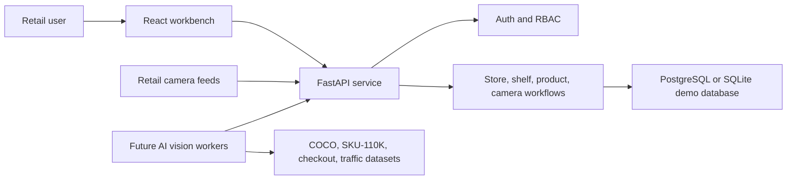

# Consumer Attention Mapping System - Milestone 1 Report

## 1. Milestone Scope

Milestone 1 covers Week 1 and Week 2 of the Consumer Attention Mapping System. The goal is to move from idea to a working foundation: project objectives, architecture, database schema, user access, store setup, shelf workflows, and camera feed onboarding.

This milestone does not yet run production computer vision models. Instead, it creates the operational base that those models will use in later milestones. A camera cannot produce useful attention analytics unless the system already knows which store, zone, shelf, and product it is observing.

## 2. Project Objective

The system is designed to help retailers understand how shoppers interact with shelves, products, promotions, and store layouts. It will eventually analyze:

- Shopper movement paths.
- Shelf dwell time.
- Gaze and attention direction.
- Product pickup and engagement behavior.
- Promotion visibility.
- Conversion from attention to purchase.

The business value is practical: retailers can use these insights to decide where to place products, which promotional displays deserve more space, which zones are underperforming, and where shopper flow should be improved.

## 3. Implemented Results

The repository now contains a working Milestone 1 vertical slice:

- FastAPI backend with authentication and role-based access control.
- SQLAlchemy database schema for stores, zones, shelves, products, placements, users, and camera feeds.
- Automatic demo data seeding.
- PostgreSQL support with SQLite demo fallback when the configured database is unavailable or incompatible.
- React frontend workbench for login, system readiness, workflow progress, store mapping, shelf intelligence, camera health, and dataset mapping.
- API endpoints for authentication, users, stores, zones, shelves, products, placements, camera feeds, and milestone documentation data.

Seeded demo accounts:

| Role | Email | Password |
| --- | --- | --- |
| Administrator | admin@attention.ai | Admin@123 |
| Store Manager | manager@attention.ai | Manager@123 |
| Retail Analyst | analyst@attention.ai | Analyst@123 |
| Marketing Manager | marketing@attention.ai | Marketing@123 |

Current seeded domain data:

| Entity | Count |
| --- | ---: |
| Users | 4 |
| Stores | 1 |
| Zones | 3 |
| Shelves | 3 |
| Products | 3 |
| Camera feeds | 3 |

## 4. System Architecture



### Layer Explanation

Frontend:
The React workbench is the operating surface for the retail team. It shows system status, login role, store map, shelf/product placement, camera feed health, workflow readiness, and dataset purpose.

Backend:
The FastAPI service exposes the system workflows. It handles login, token validation, role checks, store setup, zone creation, shelf mapping, product placement, and camera feed management.

Database:
The SQLAlchemy schema stores the core retail structure. PostgreSQL is still supported for production, while a local SQLite fallback makes the milestone demonstrable even when PostgreSQL is not ready.

Future AI Layer:
Later milestones can attach detections, tracking events, gaze events, dwell time, heatmaps, and conversion events to the entities already created in Milestone 1.

## 5. Database Schema

The milestone schema creates the operational map of the retail environment.

### Users

Stores identity and role information.

Important fields:

- name
- email
- password_hash
- role
- is_active

How it helps:
The platform can separate responsibilities. For example, a Store Manager can manage shelves and cameras, while a Retail Analyst can focus on attention analytics.

### Stores

Represents a physical retail location.

Important fields:

- name
- location
- manager_name
- floor_area_sqft
- shopper_capacity

How it helps:
Every shelf, zone, and camera belongs to a store. This makes analytics location-specific.

### Zones

Represents logical areas inside a store, such as a promo bay or beverage wall.

Important fields:

- store_id
- name
- category_focus
- expected_dwell_seconds
- heatmap_weight

How it helps:
Future camera detections can be grouped by business area instead of raw video coordinates.

### Shelves

Represents shelves inside zones.

Important fields:

- store_id
- zone_id
- code
- aisle
- category
- x_position
- y_position
- attention_score

How it helps:
The frontend can draw a simple shelf map, and future AI metrics can be attached to specific shelf positions.

### Products

Represents retail products.

Important fields:

- sku
- name
- brand
- category
- dataset_source

How it helps:
The system can connect shelf detections to recognizable products and data sources.

### Product Placements

Represents where a product is placed on a shelf.

Important fields:

- shelf_id
- product_id
- row
- column
- facing_count
- placement_quality

How it helps:
This supports shelf analytics such as whether high-attention shelves contain the right products and whether enough facings are visible.

### Camera Feeds

Represents retail camera connections.

Important fields:

- store_id
- zone_id
- name
- feed_url
- status
- fps
- coverage
- last_sync_at

How it helps:
Cameras are not just streams. They are assigned to zones, which lets later AI outputs become store intelligence.

## 6. Authentication And RBAC

The backend includes token-based authentication and role checks.

Implemented roles:

- Administrator
- Store Manager
- Retail Analyst
- Marketing Manager

Access design:

- All signed-in users can view stores and camera feeds.
- Administrators can list users.
- Administrators and Store Managers can create stores, zones, shelves, products, placements, and camera feeds.
- Administrators, Store Managers, and Retail Analysts can refresh camera heartbeat status.

How it helps:
Retail systems often include sensitive camera and performance data. RBAC prevents every user from changing operational setup while still letting teams view the information they need.

## 7. Store And Shelf Workflow

The implemented workflow is:

1. Create or load a store.
2. Create zones inside the store.
3. Add shelves to zones.
4. Add products.
5. Place products on shelves.
6. Attach attention and placement scores.
7. Visualize the shelf map and shelf intelligence chart.

How it helps:
This creates the context that makes later AI useful. A model may detect a shopper looking at a shelf, but the business question is: which shelf, which zone, which category, and which products were visible?

## 8. Camera Feed Workflow

The implemented camera workflow is:

1. Register a camera feed.
2. Assign it to a store.
3. Assign it to a zone.
4. Track its status.
5. Track FPS.
6. Refresh heartbeat status.

Current seeded feeds:

| Camera | Zone | Status | Coverage |
| --- | --- | --- | --- |
| CAM-ENT-01 | Entrance Promo Bay | Online | Entry display, promo bay, first-look dwell |
| CAM-FMCG-04 | Personal Care Aisle | Online | Shelf-facing attention and product pickup gestures |
| CAM-BEV-02 | Beverage Wall | Warning | Beverage wall dwell and traffic flow |

How it helps:
Camera integration becomes operational instead of abstract. The system knows what every feed is supposed to observe, so later detection events can be interpreted correctly.

## 9. Dataset Mapping

| Dataset | Purpose | Milestone 1 Use |
| --- | --- | --- |
| Retail Product Checkout Dataset | Retail object detection and product recognition | Product metadata source for checkout and SKU recognition workflows |
| SKU-110K Dataset | Shelf product detection and shelf analytics | Product placement and shelf recognition planning |
| COCO Dataset | Person detection and object tracking | Shopper detection and multi-person tracking planning |
| Retail Store Traffic Dataset | Consumer movement analytics | Entry, exit, path density, and traffic baseline planning |

How it helps:
The dataset mapping shows which future AI function each dataset supports. Milestone 1 prepares the data model so those model outputs have a place to live.

## 10. API Summary

Authentication:

- POST `/api/auth/register`
- POST `/api/auth/login`
- GET `/api/auth/me`

Admin:

- GET `/api/admin/users`

Store workflows:

- GET `/api/stores`
- POST `/api/stores`
- POST `/api/stores/{store_id}/zones`

Shelf and product workflows:

- POST `/api/shelves`
- POST `/api/products`
- POST `/api/product-placements`

Camera workflows:

- GET `/api/camera-feeds`
- POST `/api/camera-feeds`
- PATCH `/api/camera-feeds/{feed_id}/heartbeat`

Milestone documentation APIs:

- GET `/api/milestone/objectives`
- GET `/api/milestone/architecture`
- GET `/api/milestone/workflows`
- GET `/api/milestone/datasets`
- GET `/api/milestone/summary`

## 11. Frontend Summary

The new dashboard provides:

- Role-based login using seeded demo accounts.
- Live database and camera status summary.
- Milestone entity counts.
- Workflow readiness list.
- Store overview with location, area, capacity, and zones.
- Shelf map with shelf positions and attention scores.
- Shelf attention vs placement quality chart.
- Camera feed cards with zone assignment, FPS, coverage, and heartbeat refresh.
- Architecture and dataset mapping sections.

How it helps:
The first screen is now an actual operations workbench, not a landing page or a simple server checker. A stakeholder can understand the retail workflow immediately.

## 12. Current Verification

Backend checks completed:

- Python compile check for `backend/app`.
- Direct database smoke test.
- Demo seed data verified.
- Password verification verified.
- Token generation verified.

Smoke test result:

```text
users: 4
stores: 1
camera feeds: 3
fallback database: true
password verification: true
token parts: 3
```

Important note:
The configured PostgreSQL database was reachable, but it already had an incompatible older schema. The backend therefore switched to the local SQLite fallback database for the Milestone 1 demo. This keeps the project working while avoiding destructive changes to an existing PostgreSQL schema.

## 13. How This Helps Retail Teams

Store Managers:
They can define the physical store structure and make sure shelves, zones, and cameras match the real store.

Retail Analysts:
They get the foundation for future attention metrics, traffic monitoring, dwell analysis, and shopper journey analytics.

Marketing Managers:
They can connect product placement quality and shelf attention to campaign visibility and promotional decisions.

Administrators:
They can manage access and keep operational workflows controlled through roles.

Executives and stakeholders:
They can see that the system has moved beyond concept into an integrated platform foundation.

## 14. Next Milestone Readiness

Milestone 1 prepares the system for Milestone 2:

- Consumer detection can attach detections to camera feeds and zones.
- Multi-person tracking can create shopper sessions per store.
- Path tracking can use the store, zone, and shelf coordinates.
- Attention and gaze estimation can update shelf attention scores.
- Product interaction models can connect events to product placements.

The project is now ready for the AI vision layer because the retail context, access control, and camera management workflows are in place.
