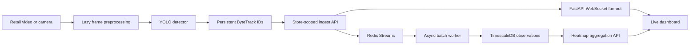

# Consumer Attention Mapping System - Milestone 2 Report

## 1. Purpose and source of truth

This report records what the repository actually implements for Milestone 2. The milestone brief requires a multi-tenant, three-zone retail simulation; memory-bounded video preprocessing; shopper and product detection; persistent multi-object tracking; Redis/TimescaleDB ingestion; WebSocket delivery; and a live heatmap dashboard.

The brief uses qualitative phrases such as "high accuracy" and "zero delay," but it provides no numeric thresholds for detector accuracy, tracker identity stability, throughput, latency, or dropped frames. This report therefore does not invent target or achieved metrics.

## 2. Required flagship layout

The demo store is organized around the layout in the milestone brief:

| Zone | Cameras | Intended analytics |
| --- | --- | --- |
| Entrance/Exit Foyer | Camera 1 | Unique entry/exit traffic and current occupancy |
| Main Product Aisle | Cameras 2 and 3 | Dense shelf detection, gaze/dwell, and product interaction |
| Checkout Lanes | Camera 4 | Queue length, bottlenecks, and anomaly alerts |

The current seed reconciliation creates these three zones and four camera records. Seed records make the API and UI demonstrable; they are not detections produced by a trained model.

## 3. Implementation status

| Requirement | Repository implementation | Evidence still required |
| --- | --- | --- |
| Multi-tenant storage and routes | Store-scoped domain rows, user-to-store access mappings, and store-scoped tracking/heatmap routes are present. | A schema review is still needed before claiming that every business entity has the exact tenancy boundary required in production. |
| Video preprocessing | Lazy OpenCV decoding, letterbox resize, deterministic frame augmentation, and bounded batching are implemented under `backend/app/ml`. | Profile with the real Retail Store Traffic videos and target hardware. |
| Dataset preparation | YOLO label validation, manifests, dataset YAML generation, and a clearly marked tiny synthetic smoke dataset are implemented. | Validate the licensed COCO/SKU-110K/Retail Product Checkout derivatives actually used for training. |
| Shopper/product detector | The codebase supports Ultralytics YOLO training/inference with reproducible run records. A pretrained one-epoch COCO8 smoke run completed and wrote checkpoints. | Complete real retail-data fine-tuning and report held-out validation output. |
| Multi-object tracking | A persistent YOLO plus ByteTrack adapter emits per-frame boxes and track IDs. Tracker state is reset between unrelated streams. | Measure ID switches and tracker quality on representative traffic footage. Cross-camera re-identification is not implemented. |
| Gaze and dwell logic | Geometry utilities map a supplied head-pose ray to a calibrated shelf plane, and a dwell state machine turns observations into events. | A head-pose/gaze model and camera/shelf calibration must supply real inputs; no gaze-accuracy claim is made. |
| Decoupled ingestion | A video worker bridges real YOLO/ByteTrack output to the API in batches of at most 100. Store-scoped events are queued through Redis Streams; an asynchronous worker persists bounded batches; a memory queue is explicitly a non-durable development fallback. | Load-test the required camera count and document throughput, latency, retry, and loss behavior. |
| Time-series storage | The high-frequency observation table has a time-inclusive primary key and can be promoted to a TimescaleDB hypertable. | Verify retention/compression policy for the production data volume. |
| Live delivery | Authenticated FastAPI WebSockets broadcast tracking events by store and expose stream status. | Measure end-to-end browser latency; "zero delay" is not a measurable acceptance threshold. |
| Heatmap dashboard | The API aggregates recent store-scoped observations into weighted heatmap points; the frontend consumes the live/aggregate data path. | Validate the floor-plan coordinate calibration and browser performance with real event volume. |

## 4. Data and model expectations

The brief assigns the datasets as follows:

- COCO supplies pretrained shopper/person detection knowledge.
- SKU-110K and Retail Product Checkout supply retail shelf/product examples for fine-tuning.
- Retail Store Traffic supplies prerecorded camera footage for preprocessing, tracking, and analytical validation.

The datasets and their redistribution rights are not bundled by this repository. Operators must obtain them from their official sources, preserve their licenses, convert labels into one reviewed class map, and keep train/validation/test splits isolated. Dataset validation should produce a manifest and content digest before a run begins.

## 5. Training status and interpretation

There are three distinct levels of evidence, and they must not be conflated:

1. **Seed-data demonstration:** Hand-authored shopper sessions, tracking points, and attention events exercise database queries and dashboard components. They are not model predictions and say nothing about AI accuracy.
2. **Synthetic smoke training:** A tiny generated YOLO dataset may be used for a one-epoch CPU run. Passing this test proves that dependency loading, dataset plumbing, checkpoint writing, and metric serialization execute. Its validation values are not retail-model performance.
3. **Real retail fine-tuning:** A defensible trained model requires the assigned retail datasets, a frozen split, recorded hyperparameters, saved checkpoints, and held-out evaluation. This work must be reported separately from smoke testing.

No metric should be copied from the seeded database counts or from an in-memory fit over those rows. At the time of this report update, no real-retail held-out detector or tracker result has been established in the repository.

The first synthetic smoke command on July 14, 2026 validated 3 generated images/annotations but stopped before training because the original environment lacked Ultralytics/Torch. Its truthful negative record is `backend/ml_runs/smoke-plumbing-20260714T050233Z-96b782db/run.json` with `status: failed`, empty metrics, and no artifacts.

A separate pretrained YOLOv8n transfer-learning smoke run then completed successfully on COCO8 using Ultralytics 8.4.95 and PyTorch 2.13.0+cpu. The effective configuration was one epoch, 160-pixel images, batch size 2, seed 42, four training images, and four validation images. Its durable record is `backend/ml_runs/coco8-transfer-smoke-20260714T050925Z-4828236b/run.json`; it inventories 16 artifacts including best/last checkpoints. The saved aggregate validation values were precision 0.938866, recall 0.266667, mAP50 0.459060, and mAP50-95 0.325967.

Those numbers are integration-smoke observations, not retail-model performance: COCO8 is tiny, the validation split contains four images, resolution and epoch count were deliberately bounded, and none of the assigned retail datasets was used.

The authenticated training API/UI path was separately smoke-tested with generated synthetic data. Training-run row `ee2f826d-08fa-4c86-bf31-44e143feb301` reached `completed` at epoch 1 with no error and persisted its observed metric fields plus artifacts under `backend/artifacts/models/store-1-detection-20260714T051420Z-a88f6cce`. Its synthetic metrics are not retail evidence; the result verifies job queueing, background execution, status persistence, and artifact reporting.

A controlled end-to-end smoke then used `best.pt` on a transient 12-frame MP4 made from one repeated COCO8 validation image. The worker produced 12 detections/observations, the API accepted all 12 in one batch with zero reported failures, the memory-fallback worker persisted 12, and the heatmap returned 12 samples in one cell. The measured 1.396 FPS and heatmap maximum 10.6206 describe only that small CPU integration run. They are not retail performance, Redis/TimescaleDB durability evidence, or a load benchmark.

## 6. Runtime data flow



Tracking events contain the tenant/store ID, camera and optional zone IDs, tracker ID, time, frame index, store coordinates, bounding-box coordinates, confidence, and optional attention fields. The ingest API verifies that referenced cameras and zones belong to the requested store before queuing an event.

## 7. Deployment

The root `docker-compose.yml` provisions:

- TimescaleDB with a persistent volume and health check.
- Redis with append-only persistence and a health check.
- The FastAPI backend with Redis fallback disabled so a broken queue is visible.
- A one-shot, idempotent hypertable bootstrap after the API schema exists.
- The built frontend served by Nginx with a health endpoint.

Local SQLite and in-memory queue fallbacks remain useful for development. They must not be described as the crash-proof Redis/TimescaleDB deployment requested by the milestone.

## 8. API surface added for Milestone 2

- `POST /api/stores/{store_id}/tracking/ingest`
- `GET /api/stores/{store_id}/tracking/observations`
- `GET /api/stores/{store_id}/heatmap`
- `GET /api/stores/{store_id}/stream/status`
- `GET /api/stores/{store_id}/checkout/status`
- `POST /api/stores/{store_id}/attention/gaze-estimate`
- `GET /api/pipeline/status`
- `POST /api/training/runs`
- `GET /api/training/runs`
- `GET /api/training/runs/{run_id}`
- `WS /ws/stores/{store_id}/tracking?token=<access-token>`

Existing session and attention-event endpoints remain available for the lower-frequency analytical model.

## 9. Acceptance assessment

The repository now contains implementation paths for the four explicit deliverables, but production acceptance remains evidence-based:

- **Continuous tracking:** Demonstrate stable ByteTrack IDs through brief occlusion on representative footage. A single-camera tracker does not guarantee the same identity across Cameras 1-4.
- **Crash-proof ingestion:** Run sustained load against Redis and TimescaleDB and record accepted, persisted, pending, failed, and dropped-event counts.
- **Live WebSocket streaming:** Record latency percentiles and reconnect behavior instead of claiming literal zero delay.
- **Interactive heatmap:** Demonstrate live and historical points on a calibrated flagship floor plan, including occupancy/overcrowding behavior.

Product-interaction detection, a trained gaze/head-pose estimator, checkout anomaly thresholds, and cross-camera re-identification remain separate validation items. The milestone brief names them but does not define algorithms or numeric acceptance criteria.

## 10. Verification record

The following checks are appropriate for the completed code and should be rerun after dependency or integration changes:

```powershell
python -m compileall backend/app backend/scripts
cd backend
.\venv\Scripts\python.exe -m unittest discover -s tests -v
cd ..
cd frontend
npm ci
npm run build
cd ..
docker compose config --quiet
```

Completed checks on July 14, 2026:

- Backend compile check passed.
- All 21 backend unit tests passed.
- Frontend production build passed with a non-fatal Vite chunk-size advisory.
- Docker Compose configuration validation passed.
- The COCO8 one-epoch transfer smoke completed and saved the run record, aggregate metrics, plots, and checkpoints described above.
- The authenticated training API/UI smoke completed and persisted its status, observed metrics, and retained artifacts.
- A 12-frame controlled saved-checkpoint -> ByteTrack -> authenticated ingest -> memory-worker persistence -> heatmap smoke completed with all 12 observations accepted and persisted.
- Docker image building was attempted but the Docker Desktop Linux daemon was unavailable, so image startup/health checks remain to be run on a host with Docker active.

Model commands, artifact paths, and the required distinction between smoke evidence and retail fine-tuning are documented in the root `README.md`.
