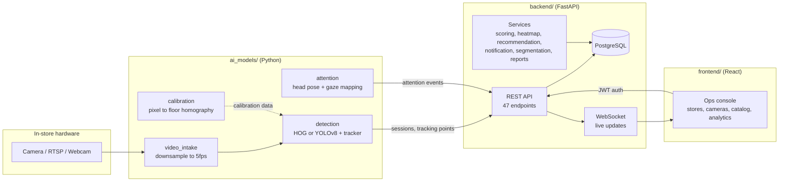
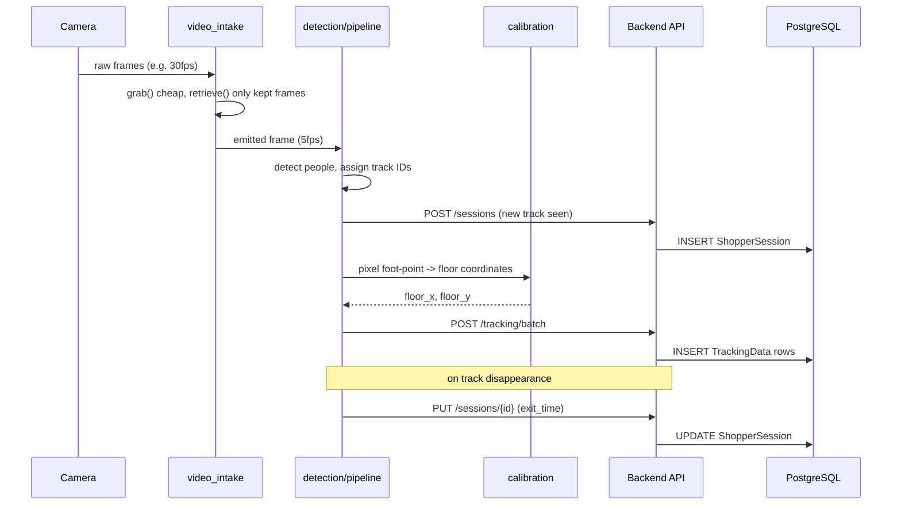
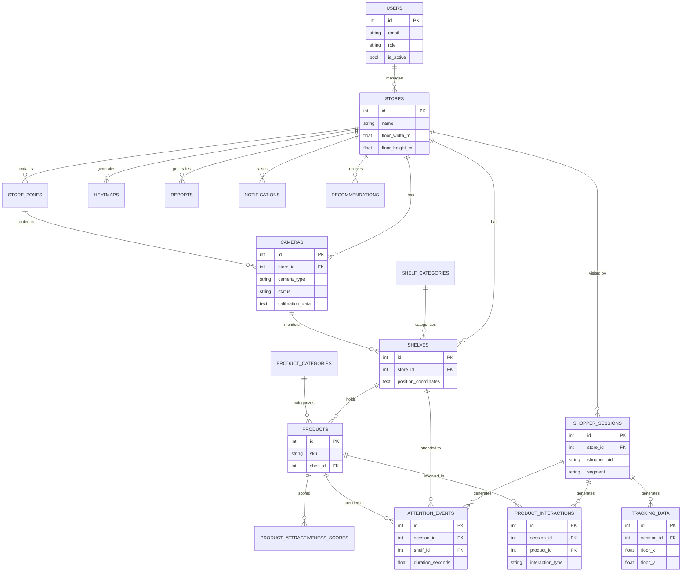

# Architecture

## System overview

## Data flow: a shopper walks through the store

## Entity-relationship diagram

## Module map

| Directory | What it is | Tested here? |
|---|---|---|
| `backend/` | FastAPI + PostgreSQL: auth/RBAC, all CRUD, scoring, heatmap, report, notification, recommendation, segmentation services | Yes — 15 tests |
| `frontend/` | React/TS/Vite/Tailwind ops console | Build-verified + live API smoke tests |
| `ai_models/video_intake/` | OpenCV FPS downsampling | Yes — 3 tests |
| `ai_models/detection/` | Person detection + tracking + backend ingest | Yes — 4 tests + live E2E |
| `ai_models/calibration/` | Pixel → floor-plane homography | Yes — 5 tests |
| `ai_models/attention/` | Head pose + gaze-to-shelf mapping | Yes — 16 tests + live E2E |
| `scripts/` | Demo data seeding | Yes — runs against SQLite/Postgres |
| `documentation/` | This file + others | — |

See each module's own README for what's genuinely tested versus what's
correct-but-blocked-by-sandbox-network integration code (YOLOv8 and
MediaPipe model weights specifically — both documented in detail in
their respective module READMEs).
